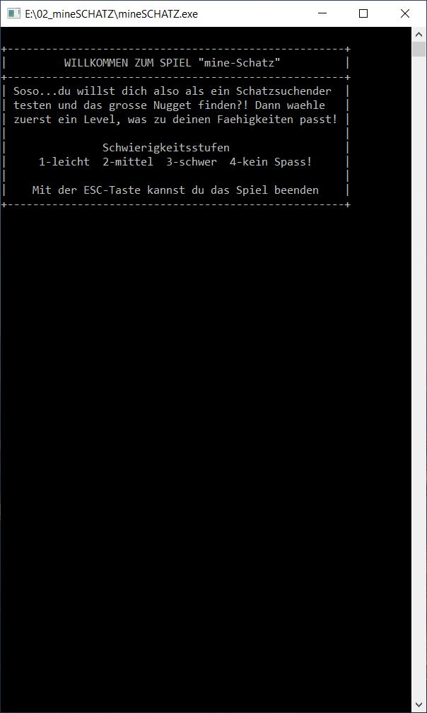
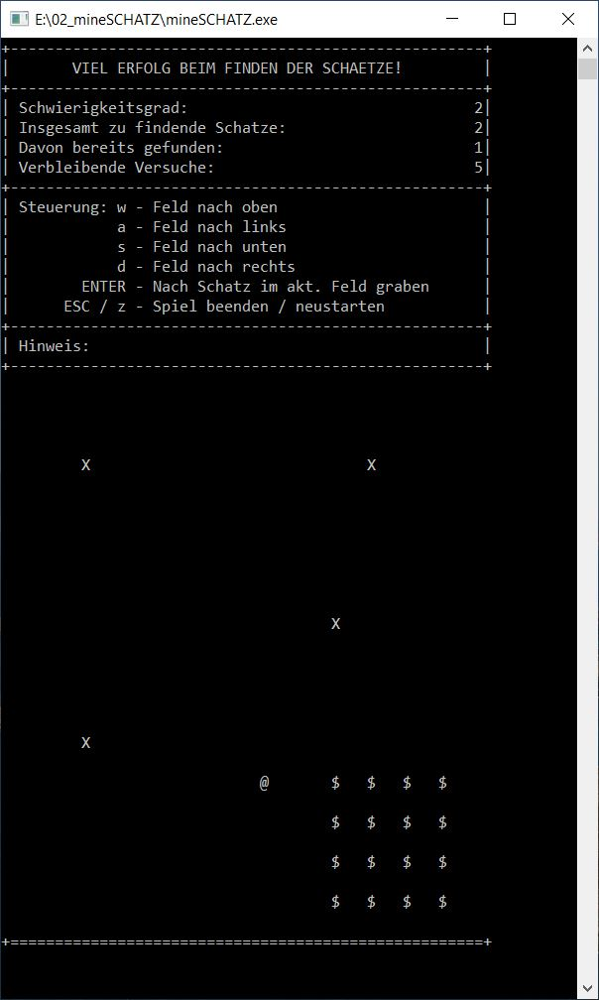
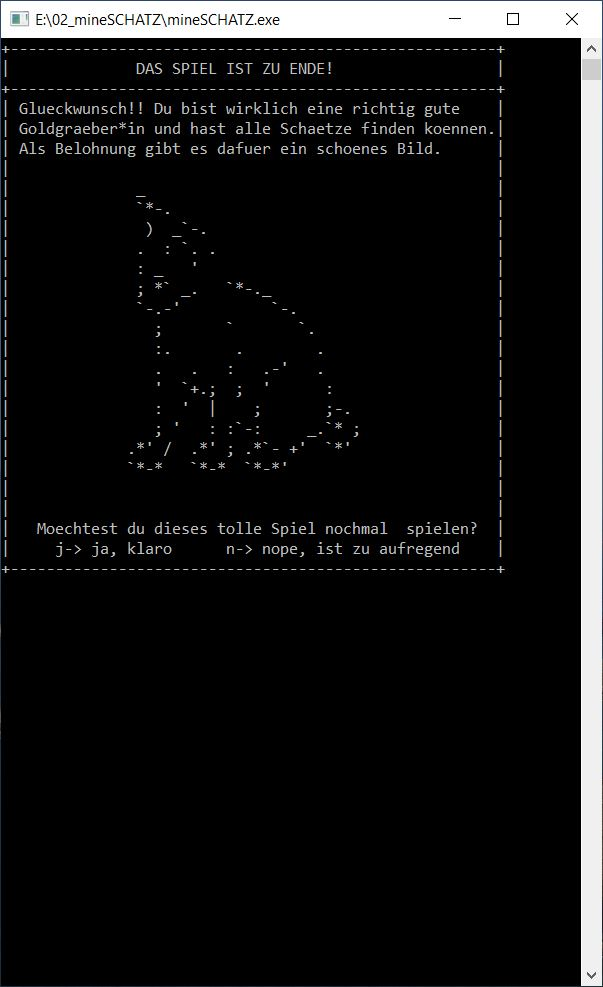

# 💰 mineSchatz

Auf dem Spielfeld (zweidimensionale Matrix) mit der Groesse von 14x14 Feldern sind ein oder mehrere Schaetze versteckt. Aufgabe ist es, diese Schaetze innerhalb der vorgegebenen Versuche zu finden.  
**Funktioniert aktuell nur unter Windows** 😏

## Grundlagen
- Abfrage Schwierigkeitsgrad (schaetzwerte, muessen in Testphase noch angepasst werden):

|   Level  | Schatzgroesse [Felder] | Schatzanzahl | Anzahl Versuche Graben |
|:--------:|:--------------------:|:------------:|:----------------------:|
| hardcore |           1          |      10      |           20           |
|  schwer  |          2x2         |       5      |           15           |
|  mittel  |          4x4         |       2      |           10           |
|  leicht  |          8x8         |       1      |        unendlich       |      

- Spieler kann mit w,a,s,d durch Spielfeld navigieren - Aktuelle Position wird mit einem '@'-Zeichen dargestellt
- mit ENTER wird nach einem Schatz im aktuellen Feld gegraben
- befindet sich an der entsprechenden Stelle ein Schatz, so wird das / werden die Felder mit einem '$' gefuellt; besteht ein 
  Schatz aus mehreren Feldern (Schwierigkeit schwer-leicht), so werden alle Felder des Schatzes aufgedeckt
- hat Spieler alle Schaetze innerhalb der Versuche gefunden, so hat er gewonnen
- jedes Feld, an welchem schon gegraben wurde, wird mit einem 'X' gekennzeichnet 
*sollte waehrend der Testphase des Spiels gemerkt werden, dass die Hinweisfunktionen notwendig ist, wird diese implementiert

## Spiellayout
### Start

### Spielfeld

### Ende

## HINWEISE ZUM PROGRAMM
listeSchaetze[anzahl der Maximal im Spiel vorkommenden Schaetze][Schatzgroesse]
- beinhaltet die Koordinaten, an denen die Schaetze versteckt sind
- wie eine Tabelle vorstellen:  

|         | Index0 | Index^1 | ... |  IndexSchatzgroesse |
|:-------:|:------:|:-------:|:---:|:------------------:|
| Schatz1 | [pos1] |  [pos2] | ... | [posSchatzgroesse] |
| Schatz2 | [pos1] |  [pos2] | ... | [posSchatzgroesse] |

  - damit wird Tabelle nach Position durchsucht, an der aktuell gegraben 
      wurde und dann kann die ganze Zeile ausgelesen werden, um alle Felder 
      des gefundenen Schatzes schreiben zu koennen (ein Schatz mit 4x4 Feldern
      soll ja komplett aufgedecktw erden, sobald ein Feld von diesem entdeckt
      wurde!)   

- Koordinaten der positionen werden als string dargestellt ("ZeileSpalte")
    z.B.: Koordinate: Zeile=13 Spalte=2 ==> "13;2"
    aktuelle Position wird auch in das Format gebracht
    - dadurch den Vorteil, dass immer nur ein Arrayfeld pro Koord. benoetigt
        wird

- Wird ins "Leere" gegraben, so wird die Position in die Struktur Grabungen
    eingetragen um sie dann in Generierung des LAyouts abfragen zu koennen